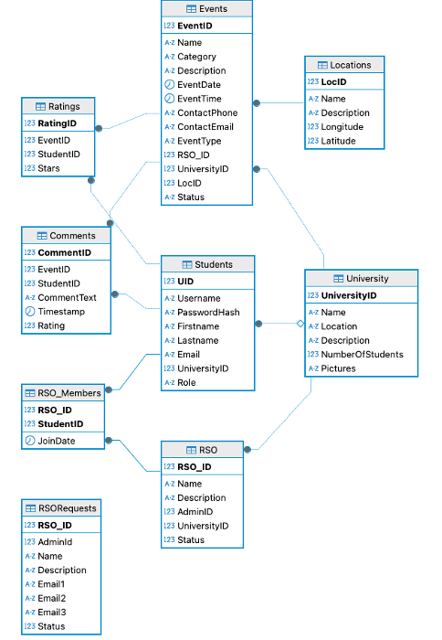
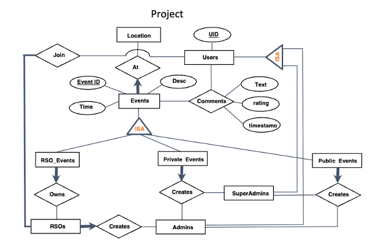

# CampusConnect

## Description

This project is an event hosting web application that can handle any number of universities, RSOs, and students. It is a full-stack application using React, Express, and MySQL.

## Table of Contents

- [Features](#features)
- [Relational Data Model](#relational-data-model)
- [Entity-Relationship Model](#entity-relationship-model)
- [SQL Triggers](#sql-triggers)
- [Team Members](#team-members)

## Features
The application supports the following features:

- Login/Registration
- Auth Context for role privileges
- Dynamic loading of events that the user has access to
- Add, edit, delete, and rate comments
- Joining and leaving RSOs
- Requesting new RSOs, with a mechanism for approval or denial by an admin
- Admin page for privileged functionality

## Relational Data Model
The foundation of the CampusConnect platform is this schema, which is made to accommodate both present and upcoming improvements.


## Entity-Relationship Model
The Entity-Relationship (ER) model for CampusConnect captures the core structure and provides a detailed look at entity membership constraints, and how entities are linked in our database.


## SQL Triggers
This section contains the SQL code that was used to force constraints for our database. This will be updated as new features are added.

#### RSO Minimum Membership
This constraint will delete an active RSO if there are less than 5 members:
```sql
-- Create the new trigger
CREATE TRIGGER RSOStatus
ON RSO_Members
AFTER INSERT, DELETE
AS
BEGIN
    SET NOCOUNT ON;

    DECLARE @rso_id INT;

    -- Get the RSO_ID from either inserted or deleted rows
    IF EXISTS (SELECT * FROM inserted)
    BEGIN
        SELECT TOP 1 @rso_id = RSO_ID FROM inserted;
    END
    ELSE IF EXISTS (SELECT * FROM deleted)
    BEGIN
        SELECT TOP 1 @rso_id = RSO_ID FROM deleted;
    END

    -- Count how many members the RSO has now
    DECLARE @member_count INT;
    SELECT @member_count = COUNT(*) FROM RSO_Members WHERE RSO_ID = @rso_id;

    -- If fewer than 5 members, delete the RSO
    IF @member_count < 5
    BEGIN
        DELETE FROM RSO WHERE RSO_ID = @rso_id;
    END
    -- Otherwise, do nothing
END;
```

## Team Members
- Trever Jones
- Gabriel Rachdan
- Faris Alamoudi
